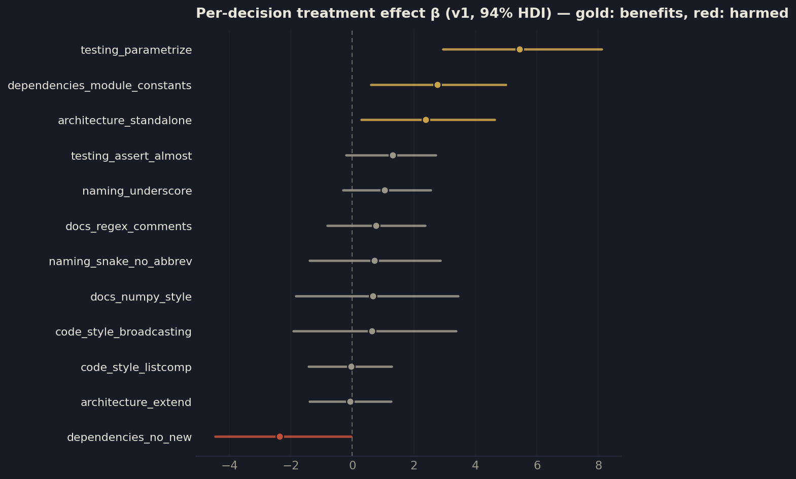
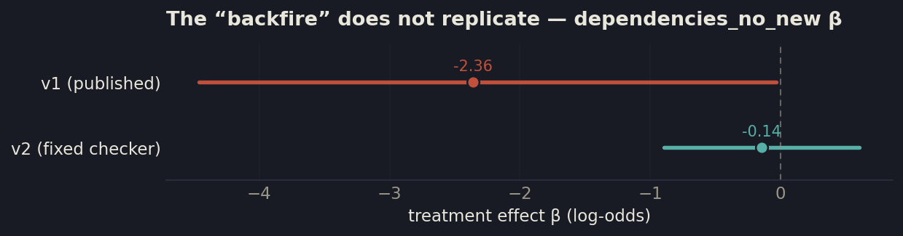
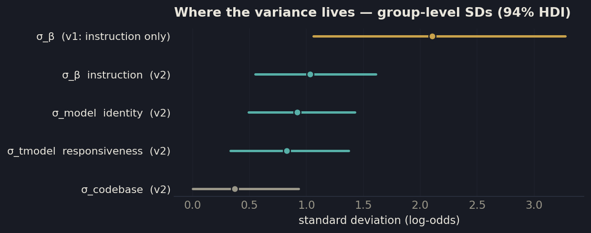
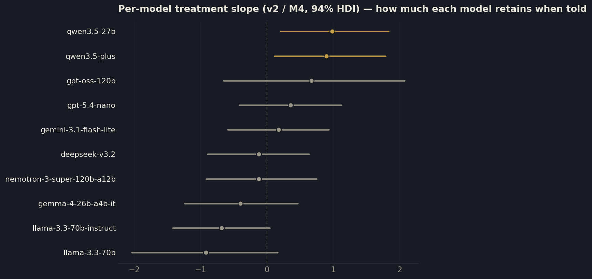
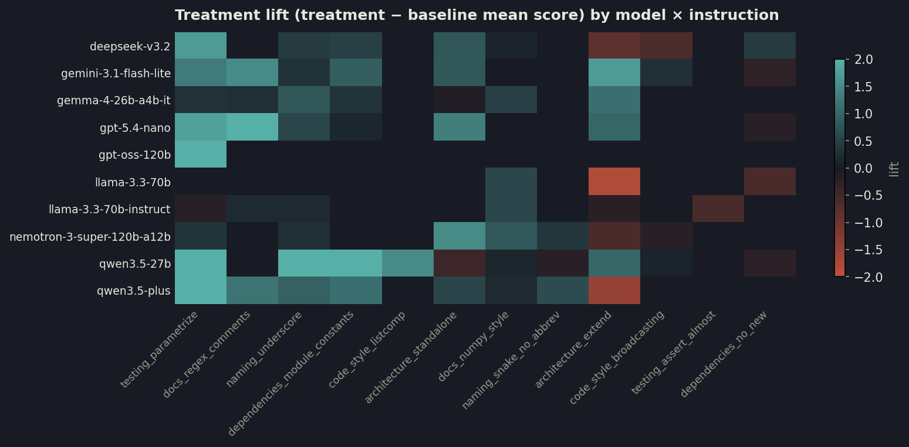

# Not All Instructions Are Forgotten Equal

*Per-instruction retention in long LLM coding conversations. 55 JAIIO / ASAID 2026.*

---

> **Note on scope.** This report mirrors the accepted paper (the v1 study). Numbers
> come from the Bayesian fit in `experiments-v1/analysis/`. A separate v2 re-run
> (Inspect AI port, more models, epochs, a cross-family judge panel) is in progress
> and is documented under `docs/`; where v2 changes the story, it is flagged in §7.

---

## 1. Introduction

Large language models lose adherence to instructions over extended conversations, a
phenomenon we call *context rot*. The cause is architectural: attention is not
distributed uniformly across the context window, and information in middle positions
receives less weight than information at the boundaries. System-prompt instructions sit
at position zero, where causal attention gives them a compounding advantage.
User-stated preferences, introduced mid-conversation, get no such benefit — they
compete for attention against everything that accumulates after them.

This matters for two concrete reasons. Reinforcement costs tokens: the common fix,
repeating every instruction each turn, multiplies prompt cost at scale. And safety
guardrails are instructions like any other — if they decay, the system fails silently,
with no error raised.

No prior work has measured retention at the level of the *individual instruction*.
Existing studies report mean compliance across instruction sets, or propose uniform
mitigations such as periodic reminders. But if each instruction decays at a different
rate, the mean hides the structure that matters: an instruction the model already
follows needs no reinforcement, and one that is *harmed* by repetition should never
receive it. Without per-instruction estimates, any reinforcement policy is flying blind.

We test whether retention is heterogeneous using a Bayesian hierarchical ordered-logistic
model fitted to compliance scores from realistic multi-turn coding conversations. We
report three findings: retention heterogeneity across instruction types is large
(treatment effects span −2.4 to +5.4 on the log-odds scale, σ_β = 2.1); one instruction
type is actively harmed by being stated; and we find little evidence that model
architecture or codebase size explains the variance — it is almost entirely in the
instruction itself.

## 2. Related work

Several studies establish that LLMs lose adherence as conversations grow. Laban et al.
(2025) measured an average 39% compliance drop across 15 models in multi-turn settings;
He et al. (2024) showed accuracy on multi-instruction tasks dropping from 87.7% to 70.7%
within three turns. All report aggregate metrics; none asks whether different
instructions degrade at different rates. On mechanism, Liu et al. (2024) identified a
U-shaped attention curve (boundaries over middle), and Mu et al. (2025) a saturation
effect (more guardrails, lower per-rule compliance). Existing mitigations — periodic
reminders, prompt repetition — reinforce all instructions uniformly. Bayesian Knowledge
Tracing (Corbett & Anderson, 1994) offers per-concept mastery estimation; we invert it,
tracking what an LLM has *forgotten* rather than what a student has learned.

## 3. Method

### 3.1 Decision planting

We simulate a coding assistant working on a real open-source codebase over 25 turns.
Real source files are injected at turns 0–19, building context pressure. In the
**treatment** condition, 12 coding preferences are embedded as casual inline requests in
the user's messages — six early (turns 1–7), six late (turns 14–19) — spanning code
style, architecture, testing, naming, dependencies, and documentation. They are phrased
as natural user preferences, not system-prompt rules. The **baseline** condition is
identical (same files, same task) with nothing planted, measuring what the model does by
default. At turns 20–25 the user requests code-generation tasks that elicit each
decision; each test turn probes two decisions (one early, one late).

### 3.2 Compliance measurement

Each decision is scored by a deterministic checker that parses the generated code with
regular expressions and pattern matching — no LLM in the scoring loop, so results are
reproducible across runs. Each checker emits an ordinal 0–3 score (0 = ignored,
1 = minimal, 2 = mostly followed, 3 = fully followed).

### 3.3 Bayesian model

We model the ordinal scores with a hierarchical ordered-logistic (cumulative-link)
regression. For observation *i*, the latent compliance is
η_i = α_{d[i]} + β_{d[i]} · treatment_i, where α_d is the per-decision baseline and β_d
the per-decision treatment effect, both given non-centered hierarchical priors. The key
scientific parameter is **σ_β**, the group-level standard deviation of treatment effects:
a large σ_β means instructions respond very differently to being stated — the premise
selective reinforcement requires. Fitted in PyMC with NUTS (4 chains, 1000 draws each).

### 3.4 Setup

Three open-source Python libraries span a range of context pressure: **Bambi** (~10K
lines, ~98K tokens by turn 20), **ArviZ** (~25K, ~160K), and **PyMC** (~57K, ~203K).
Five instruction-following models were evaluated; Qwen 3.5 (27B) served as the primary
model with both baseline and treatment across all three codebases, and four others
(Gemini 3.1 Flash Lite, GPT-5.4-nano, Nemotron 3 Super 120B, Gemma 4 26B) in treatment
only, to check that patterns generalize. The final dataset is **244 compliance
observations** across 5 models, 12 decision types, 3 codebases, and 2 conditions.

## 4. Results

The model converged cleanly: zero divergences, R̂ ≤ 1.01, minimum ESS = 1311. Posterior
predictive checks reproduce the observed score distribution.

### 4.1 Treatment-effect heterogeneity is large

The group-level standard deviation of treatment effects is **σ_β = 2.11** (94% HDI
[1.06, 3.28]); individual effects range from −2.36 to +5.44 on the log-odds scale. The
posterior separates the 12 decisions into three groups.

| Group | decisions | reading |
|-------|-----------|---------|
| **Benefit from reinforcement** (HDI > 0) | `testing_parametrize` (β=5.44), `dependencies_module_constants` (2.76), `architecture_standalone` (2.38) | near-zero baseline; retained when stated |
| **Harmed by reinforcement** (HDI < 0) | `dependencies_no_new` (β=−2.36) | stating it *reduces* compliance |
| **No intervention needed** (HDI crosses 0) | the other 8 | already followed by default, or no signal |

Figure 1 — Each instruction's treatment effect β with 94% HDI, ranked. Gold = benefits from being stated (HDI above zero); red = harmed; grey = no clear effect. The spread (σ_β = 2.1) is the heterogeneity the paper is named for.
{: .figcap}

### 4.2 One instruction is harmed by being stated

`dependencies_no_new` is the only decision where telling the model *lowers* compliance
(baseline mean 2.25 → treatment mean 0.77; P(β<0) = 0.98). It is also the only
instruction phrased as a negation ("do not add new imports"). Whether the effect is the
content (import management) or the framing (negation) is left to future work — the
sharpest test, suggested by a reviewer, re-runs the HDI-above-zero instructions under
negated paraphrases (and the negated one under positive paraphrases).

Figure 2 — The v1 "backfire" (β = −2.36) does not survive v2: once re-shown existing imports are no longer counted as new, the effect is ≈ 0. It was a checker artifact, not a real harm (see §7).
{: .figcap}

### 4.3 Model and codebase explain little variance

We find little evidence that model architecture or codebase size explains meaningful
variance in retention; the resolvable variation is almost entirely in the instruction
type itself. (Caveat: the baseline condition comes from a single model, so per-model
retention cannot be fully separated — see §6.)

Figure 3 — Where the variance lives. In v1 (one baseline model) only σ_β is estimable. In v2, with baselines for all models, model identity (σ_model) and responsiveness (σ_tmodel) explain as much as the instruction type; codebase explains little.
{: .figcap}

### 4.4 Reinforcement priorities

Using the posterior, we rank decisions by the gain in P(score ≥ 2) from reinforcement.

| Decision | gain | 94% HDI | action |
|----------|------|---------|--------|
| `testing_parametrize` | +0.78 | [+0.46, +0.96] | reinforce |
| `module_constants` | +0.51 | [+0.18, +0.76] | reinforce |
| `arch_standalone` | +0.34 | [+0.06, +0.61] | reinforce |
| `naming_underscore` … `docs_regex_comments` | +0.14…+0.24 | crosses 0 | uncertain |
| 5 other types | < +0.04 | crosses 0 | skip |
| `deps_no_new` | −0.47 | [−0.77, −0.05] | never reinforce |

A uniform policy that reinforces all 12 would spend tokens on 8 instructions that need no
help and one that is actively harmed.

## 5. Discussion

Treatment effects follow a clear pattern: instructions that ask for something the model
would not do by default are retained when stated; instructions that match existing
behavior show no effect. The three clear winners all have near-zero baseline; the
no-effect decisions have baseline compliance near 3.0 — restating them buys nothing. The
practical implication is direct: uniform reinforcement wastes most of its budget, and a
posterior-derived ranking can say what to reinforce, what to leave alone, and what to
never mention.

## 6. Limitations

Baseline data comes from one model (Qwen); a sensitivity analysis restricted to Qwen
(132 of 244 observations) correlates with the full fit at r = 0.80 and keeps σ_β stable
(2.35 vs 2.11), but one decision (`architecture_standalone`) does not replicate in the
Qwen-only fit. The dataset has 244 observations, some decision-by-condition cells as
small as 4; partial pooling handles the sparsity but the "uncertain" rankings are
preliminary. Compliance was measured at turns 20–25 only — a retention *snapshot*, not a
decay curve, so per-instruction decay rates are not estimated. The deterministic checkers
have construct-validity limits: when no relevant pattern is found, some default to a
score of 2, and the `no_new_imports` checker penalizes any import statement.

## 7. Future work — and the v2 update

Six directions follow from the results and reviewer feedback: full-factorial baselines
across every model; a triangulated, debiased compliance measure pairing the deterministic
checkers with a blinded cross-family LLM-judge panel; disentangling phrasing from
instruction type via negated/positive paraphrases; dense temporal measurement (scoring
every turn) to fit per-instruction decay curves; closed-loop evaluation of the selective
policy against uniform reinforcement; and ecological validity from real coding sessions.

A v2 re-run (Inspect AI port) already implements several of these. Two early v2 results
revise the v1 story and are documented in `docs/`: the `dependencies_no_new` "backfire"
does **not** replicate once re-shown imports are no longer counted as violations (it is a
v1 checker artifact), and with baselines collected for *all* models, model identity in
fact explains as much variance as the instruction type. The heterogeneity thesis itself
holds, at roughly half the v1 magnitude.

Figure 4 — v2 per-model treatment slope: how much each model retains an instruction when told, beyond the average. The Qwen models are the only two clearly above zero — the v1 study's primary model is unusually instruction-responsive.
{: .figcap}

Figure 5 — Treatment lift (treatment − baseline mean) per model × instruction. `testing_parametrize` is the one consistent column (teal across models); most cells flip sign by model. Cross-model agreement is weak (Kendall's W = 0.27), so *which* instruction is retained depends on the model — retention is a (model, instruction) property, not instruction-alone. The heterogeneity is real but only 44% baseline-driven; the rest is instruction-specific.
{: .figcap}

## Appendix

Code, data, checkers, and analysis notebooks: `experiments-v1/` (the published study) and
the repo root (the v2 Inspect port). Model-exploration detail, audit, and the writing
register are under `docs/`.
